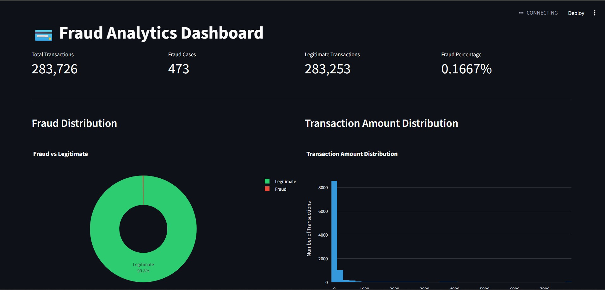
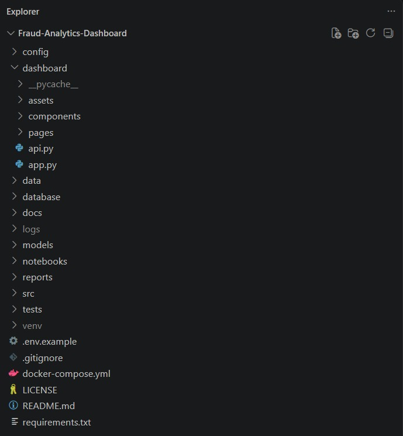
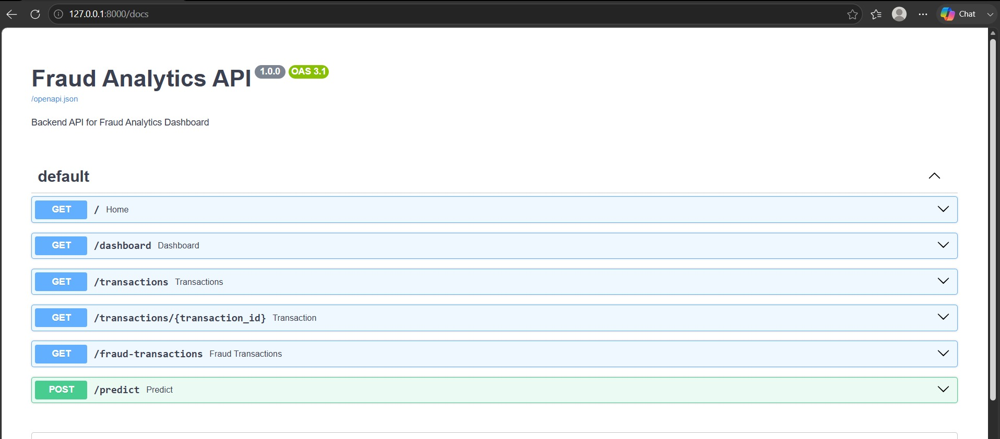
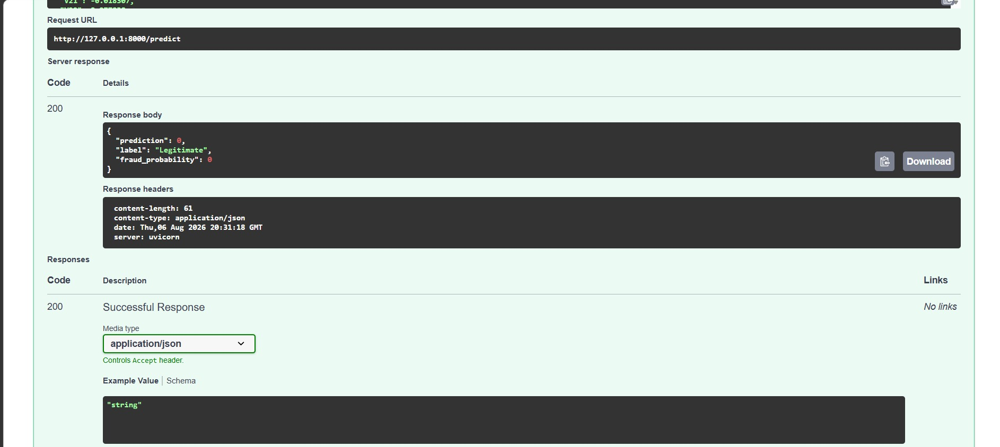
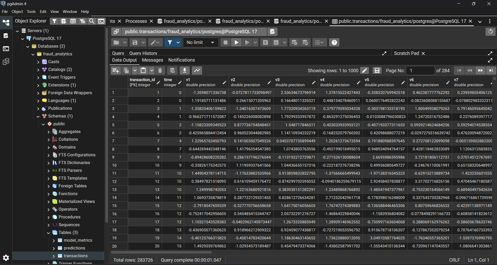

# 💳 Fraud Analytics Dashboard

A complete end-to-end Fraud Detection System built using **Python, PostgreSQL, FastAPI, Streamlit, and Machine Learning**.

This project demonstrates a production-style data analytics workflow, starting from raw transaction data and ending with an interactive dashboard and prediction API.

---

# Dashboard



---

# Features

- 📊 Interactive Streamlit Dashboard
- 🤖 Machine Learning Fraud Detection
- ⚡ FastAPI REST API
- 🗄 PostgreSQL Database Integration
- 📈 Fraud Analytics & Visualizations
- 📦 ETL Pipeline
- 🔍 Transaction Explorer
- 🚀 Prediction Endpoint

---

# Tech Stack

| Category | Technology |
|----------|------------|
| Language | Python |
| Database | PostgreSQL |
| Backend | FastAPI |
| Dashboard | Streamlit |
| Machine Learning | Scikit-learn |
| Model | Extra Trees Classifier |
| Visualization | Plotly |
| Data Processing | Pandas, NumPy |

---

# Machine Learning

### Dataset

Credit Card Fraud Detection Dataset

- Total Transactions: **283,726**
- Fraud Cases: **473**
- Legitimate Cases: **283,253**

---

### Best Model

**Extra Trees Classifier**

**F1 Score**

```
0.8503
```

The model predicts whether a transaction is fraudulent based on 30 anonymized transaction features.

---

# Project Architecture

```
Raw CSV Dataset
        │
        ▼
Data Cleaning
        │
        ▼
Feature Engineering
        │
        ▼
Machine Learning Model
        │
        ▼
PostgreSQL Database
        │
        ▼
FastAPI Backend
        │
        ▼
Streamlit Dashboard
```

---

# Project Structure



```
Fraud-Analytics-Dashboard
│
├── dashboard/
├── database/
├── models/
├── notebooks/
├── reports/
├── src/
├── data/
├── assets/
├── requirements.txt
└── README.md
```

---

# Dashboard Features

### KPI Cards

- Total Transactions
- Fraud Cases
- Legitimate Transactions
- Fraud Percentage

### Charts

- Fraud Distribution
- Transaction Amount Distribution

---

# FastAPI Documentation



Available API Endpoints

```
GET /
GET /dashboard
GET /transactions
GET /transactions/{id}
GET /fraud-transactions
POST /predict
```

---

# Fraud Prediction API



The prediction endpoint accepts transaction features and returns:

- Prediction
- Fraud Probability
- Fraud / Legitimate Label

---

# PostgreSQL Database



The application stores transaction data inside PostgreSQL and serves analytics directly from the database.

---

# Installation

Clone the repository

```bash
git clone https://github.com/saadmd13/Fraud-Analytics-Dashboard.git
```

Install dependencies

```bash
pip install -r requirements.txt
```

Run FastAPI

```bash
uvicorn src.api.main:app --reload
```

Run Streamlit Dashboard

```bash
streamlit run dashboard/app.py
```

---

# Future Improvements

- User Authentication
- Real-time Fraud Monitoring
- Live Transaction Streaming
- Docker Deployment
- Cloud Deployment (AWS / Azure)
- Model Retraining Pipeline

---

# Author

**Saad Mohammed**

GitHub

https://github.com/saadmd13